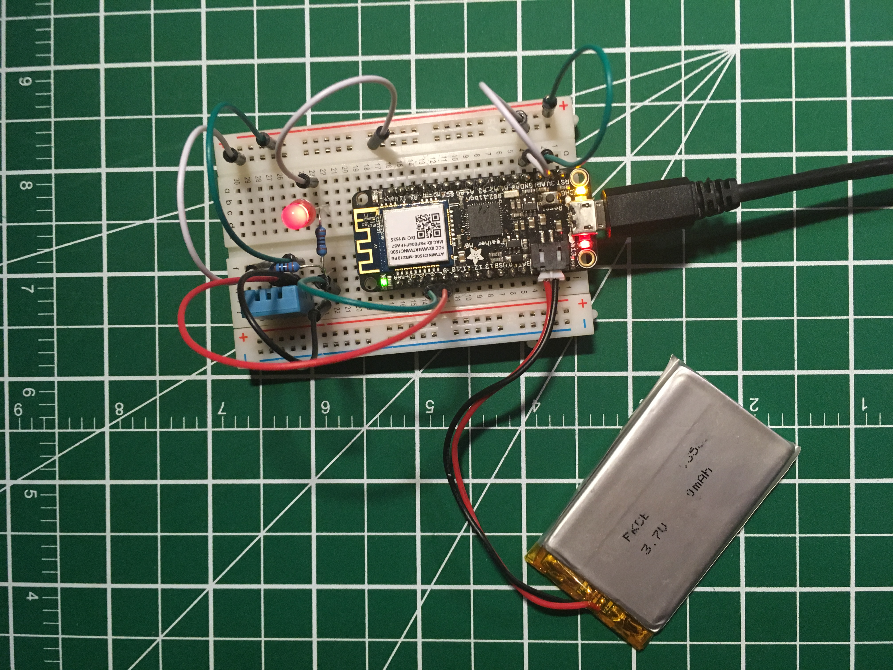
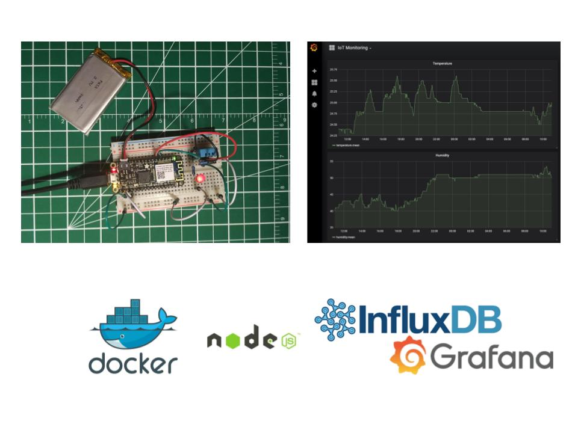

# IoT Monitoring - MQTT

Environment monitoring with MQTT, InfluxDB, and Grafana

> [Tomas Hrdlicka](https://tomas.hrdlicka.co.uk) & [HackTheBase](https://hackthebase.com) - [UCW Labs Ltd.](https://ucwlabs.com)

- [Resources](#resources)
- [Workshop](#workshop)
- [Exercises](#exercises)
  - [Wifi Sensor Node with DHT sensor](#wifi-sensor-node-with-dht-sensor)
    - How to collect data from the DHT sensor and send it to the MQTT broker
  - [MQTT Bridge (Node.js)](#mqtt-bridge-nodejs)
    - Reading data from MQTT and storing them in the InfluxDB
  - [Grafana](#grafana)
    - How to configure the data source in the Grafa to access data from the InfluxDB and how to create a simple 
      dashboard showing temperature and humidity data

## Resources
* [Slides](https://drive.google.com/open?id=1XYr1KQWU233362ymV5fVowYsThvOCpUj)
* [Poster](https://drive.google.com/open?id=19tk4AOsQs3g9wI03OpxRLY7dbAHhmfbF)
* [Video](https://youtu.be/puEkexriMVw)
* [Adafruit Feather M0 WiFi with ATWINC1500](https://learn.adafruit.com/adafruit-feather-m0-wifi-atwinc1500?view=all)
* [Sensor - DHT11](https://www.adafruit.com/product/386)
* [Sensor - DHT12](https://www.adafruit.com/product/385)
* [Sensor - BME280](https://www.adafruit.com/product/2652)
* [MQTT](http://mqtt.org)
* [Eclipse Mosquitto - An open source MQTT broker](https://mosquitto.org)
* [MQTT.js - A client library for the MQTT protocol](https://www.npmjs.com/package/mqtt)
* [Get started with Docker](https://docs.docker.com/get-started)
* [Nodejs](https://nodejs.org/en/)
* [NPM](https://www.npmjs.com/)

## Workshop
Thanks for taking the workshop IoT Monitoring for [MQTT](http://mqtt.org) at 
[HackTheBase IoT Garage](https://www.meetup.com/hackthebase-iothub-vancouver/events/264879385).

You can watch the video recording of the workshop on [YouTube](https://youtu.be/puEkexriMVw).

- We provide workshops and courses for various technologies:
  - IoT (Arduino, Particle, LoRaWAN, MQTT, ...)
  - Web (Java, .NET, JavaScript, C/C++, ...)
  - DevOps (Docker Swarm, Kubernetes, GitLab, Zabbix, Grafana, PostgreSQL, ...)
  - and more

List of available workshops you can find at [https://hackthebase.com/workshops](https://hackthebase.com/workshops)

Do you need a private workshop or course? [Contact us](https://ucwlabs.com/display/home#contact)

## Exercises

Clone (or download and unzip) the repository

```	
$ git clone https://github.com/ucwlabs/iot-monitoring-mqtt.git iot-monitoring-mqtt
$ cd iot-monitoring-mqtt/
$ chmod +x run.sh
```

### Wifi Sensor Node with DHT sensor



#### LIBRARIES

Ensure the following libraries have been installed:

Arduino libraries:  	
* [Adafruit Unified Sensor](https://github.com/adafruit/Adafruit_Sensor)
* [DHT sensor](https://github.com/adafruit/DHT-sensor-library)
* [Adafruit BME280](https://github.com/adafruit/Adafruit_BME280_Library)
* [Arduino Client for MQTT](https://github.com/knolleary/pubsubclient)
	
by taking the following steps:  
* Go to: Sketch -> Include Library -> Manage Libraries...
* enter the libraries above in the search bar and install  

#### INCLUDE THE NECESSARY LIBRARIES
Include the following files below
```
#include <WiFi101.h>
#include <PubSubClient.h>
#include <DHT.h>
```

#### DECLARE DHT PIN AND TYPE AND CREATE OBJECT
  
Provide the I/O pin that is connected to the DHT PIN 2 (data pin) and DHT type
```
#define DHTPIN 9
#define DHTTYPE DHT11
```
Create DHT object
```
DHT dht(DHTPIN, DHTTYPE);
```

#### READING THE DATA

Read and collect data from the sensor or any device as defined by the user

```
String readData() {
  String data = "";
  
  // Read humidity
  float h = dht.readHumidity();
  // Read temperature as Celsius (the default)
  float t = dht.readTemperature();
  // Read temperature as Fahrenheit (isFahrenheit = true)
  float f = dht.readTemperature(true);

  // Check if any reads failed and exit early (to try again).
  if (isnan(h) || isnan(t) || isnan(f)) {
    Serial.println(F("Failed to read from DHT sensor!"));
    return data;
  }
  
  // Compute heat index in Fahrenheit (the default)
  float hif = dht.computeHeatIndex(f, h);
  // Compute heat index in Celsius (isFahreheit = false)
  float hic = dht.computeHeatIndex(t, h, false);
    
  data = "{\"humidity\": %humidity,\"temperature\": %temperatureC,\"temperatureF\": %temperatureF,\"heat_index\": %heat_indexC,\"heat_indexF\": %heat_indexF}";
  data.replace("%humidity", String(h));
  data.replace("%temperatureC", String(t));
  data.replace("%temperatureF", String(f));
  data.replace("%heat_indexC", String(hic));
  data.replace("%heat_indexF", String(hif));
    
  return data;
}
```

#### FULL EXAMPLE
  
The full code for the Wifi Sensor Node with DHT sensor can be found 
[here](https://github.com/ucwlabs/iot-monitoring-mqtt/blob/master/feather-m0-wifi-dht/feather-m0-wifi-dht.ino).

### MQTT Bridge (Node.js)

#### Install Docker and Docker Compose

* [Get started with Docker Desktop for Windows](https://docs.docker.com/docker-for-windows)
* [Get started with Docker Desktop for Mac](https://docs.docker.com/docker-for-mac)

#### Install Node.js

1 How to install Node.js on Windows

* Go to the site [https://nodejs.org/en/download/](https://nodejs.org/en/download/) and download the necessary binary files.
  In our example, we are going to download the 64-bit setup files for Node.js (.msi package).
* Follow instructions on the screen.

2 How to install Node.js on macOS

```
$ /usr/bin/ruby -e "$(curl -fsSL https://raw.githubusercontent.com/Homebrew/install/master/install)"
$ brew -v
$ brew install node
$ node -v
$ npm -v
```

* [How to install NodeJS and NPM on Mac using Homebrew](https://www.dyclassroom.com/howto-mac/how-to-install-nodejs-and-npm-on-mac-using-homebrew)

#### Libraries

```
$ cd mqtt-bridge/
$ npm install
```

#### Run MQTT Bridge

```	
$ ./run.sh
$ docker ps -a
$ docker container logs -f mqtt-bridge
```

### Grafana

Open web browser and go to [http://localhost:3000](http://localhost:3000)
* Username: admin
* Password: admin


Follow instruction from [slides](https://drive.google.com/open?id=1XYr1KQWU233362ymV5fVowYsThvOCpUj) (pages # 15-20)
to configure the [data source](https://grafana.com/docs/features/datasources/influxdb/) 
for [InfluxDB](https://www.influxdata.com/products/influxdb-overview/) 
and [dashboard](https://grafana.com/docs/guides/getting_started/).

